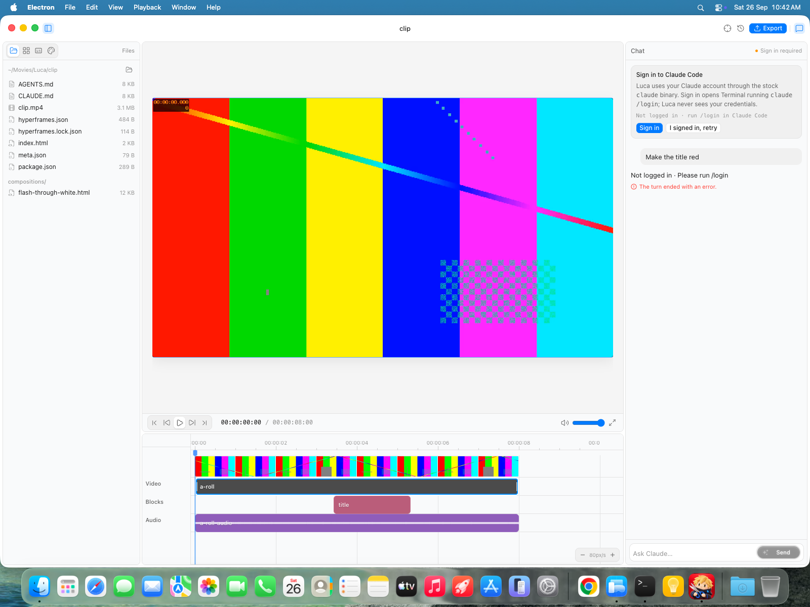
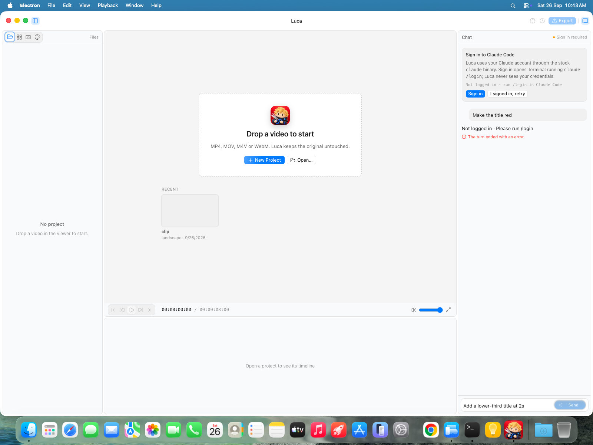
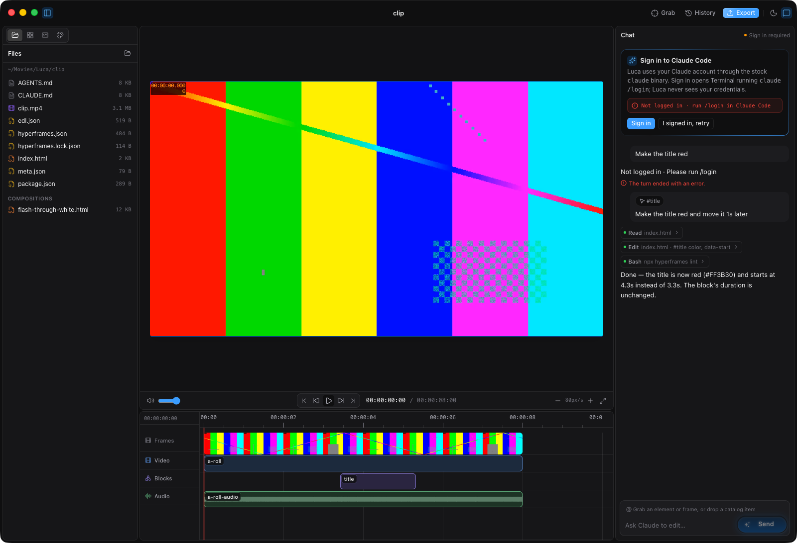
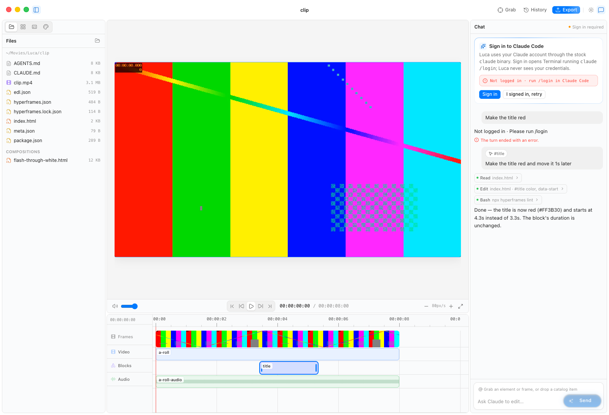
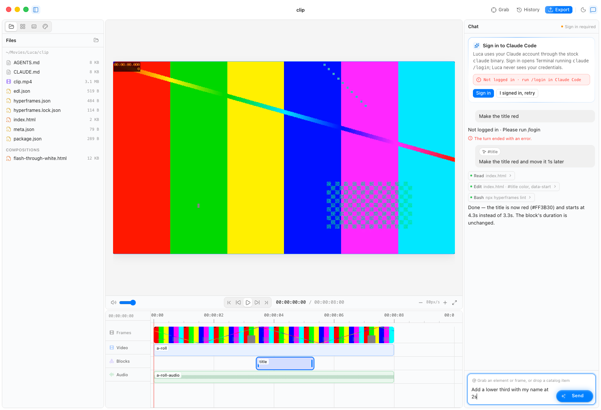
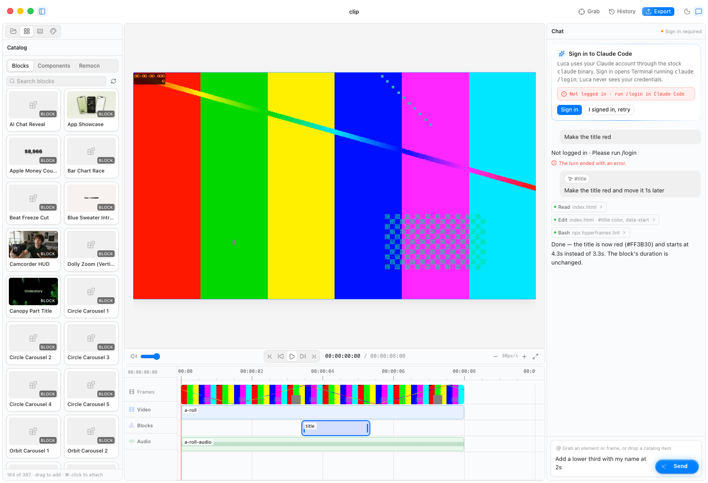
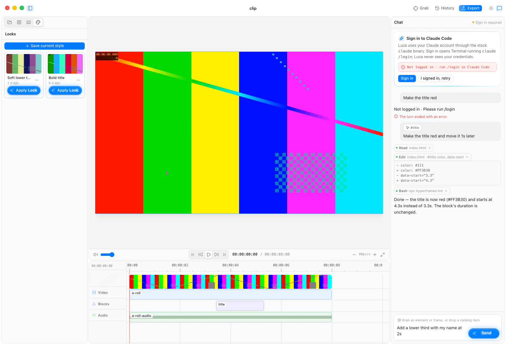
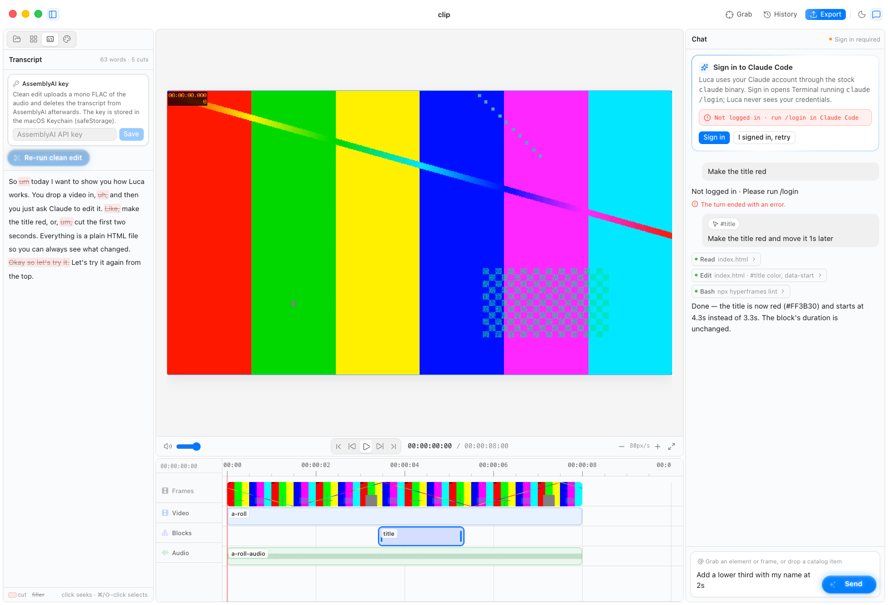
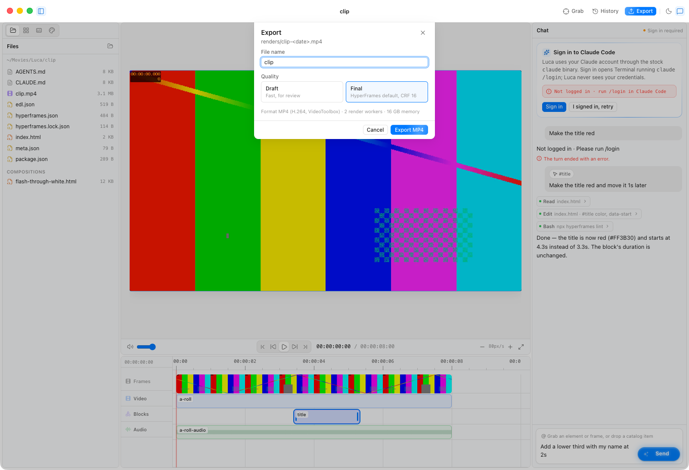

<h1> Luca</h1>

A personal macOS video editor where Claude does the editing and HyperFrames HTML is the timeline.



## What it does

|     |                   |                                                                                                                                                                                                                                                                                                                             |
| --- | ----------------- | --------------------------------------------------------------------------------------------------------------------------------------------------------------------------------------------------------------------------------------------------------------------------------------------------------------------------- |
| F1  | **Projects**      | Start from anything: a prompt, one photo, many images, an audio track or a video (drop it on the start card or the chat). Pick catalog components for Luca to use. Reopen, forget or trash recent projects; Home (⇧⌘W) closes a project and goes back to the start screen without quitting. Source media is never modified. |
| F2  | **Live preview**  | Plays the composition in the same Chromium engine that renders the export; hot-reloads within 1 s of any file change and keeps the playhead.                                                                                                                                                                                |
| F3  | **Timeline**      | Tracks, clips, captions and audio waveform; playhead, zoom, snapping; drag to move, trim, split; a selection bar and right-click menu to split, trim to the playhead or delete (a video goes with its own audio); track mute and lock; undo toasts.                                                                         |
| F4  | **Chat**          | Luca, a Claude Code agent on your own Claude subscription: shows what it is doing in plain words (“Luca is adding a lower third…”), streams replies, asks before unlisted steps; Stop.                                                                                                                                      |
| F5  | **Grab**          | Hover the preview, click an element or a frame, and a reference chip lands in the chat composer.                                                                                                                                                                                                                            |
| F5b | **Move & resize** | Click anything in the preview (or select its clip) to get handles: drag to move, drag a corner to resize. Saved as CSS `translate`/`scale`, so animations keep playing on top.                                                                                                                                              |
| F6  | **Catalog**       | Every HyperFrames block and component plus Remocn's components in one library: search in plain words, browse by category, click to ask Luca or drag onto the timeline.                                                                                                                                                      |
| F7  | **Clean edit**    | AssemblyAI transcript with fillers kept, then an agent-reviewed cut list applied with ffmpeg to produce a clean master with remapped captions. Every step shows real progress.                                                                                                                                              |
| F7b | **Captions**      | Caption Studio: words cleaned of ums, stutters and false starts, grouped into lines; ten animated styles previewed live; built-in fonts or your own font files; one click puts them on the timeline as a HyperFrames captions composition.                                                                                  |
| F8  | **Looks**         | Save a project's style (`LOOK.md`, components, catalog items) as a named Look; apply it to a new project in one click.                                                                                                                                                                                                      |
| F9  | **Versions**      | Every agent turn and manual edit is a git checkpoint: browse history, restore, ⌘Z.                                                                                                                                                                                                                                          |
| F10 | **Export**        | Render MP4 (Draft or Final) in a background process with progress and cancel, then Reveal in Finder.                                                                                                                                                                                                                        |
| F11 | **Remocn**        | Browse Remocn's Remotion components beside the HyperFrames catalog; placed components render to transparent WebM clips on the timeline.                                                                                                                                                                                     |
| F12 | **Inspiration**   | Ready-made ideas (titles, captions, transitions, social cards) with previews; one click puts the idea in the chat for you to finish.                                                                                                                                                                                        |
| F13 | **Voice**         | Dictate into the chat, or talk with Luca hands-free: AssemblyAI real-time speech-to-text, then Luca's replies read aloud.                                                                                                                                                                                                   |

## Screenshots

| Empty state                                      | Dark mode (toolbar toggle, View → Appearance, ⇧⌘D) |
| ------------------------------------------------ | -------------------------------------------------- |
|  |   |

| Timeline with a selected clip                                      | Chat                               |
| ------------------------------------------------------------------ | ---------------------------------- |
|  |  |

| Catalog                                  | Looks                                | Transcript                                     |
| ---------------------------------------- | ------------------------------------ | ---------------------------------------------- |
|  |  |  |

| Export sheet                                       |
| -------------------------------------------------- |
|  |

## Download

Grab the latest `luca-<version>-arm64.dmg` from [Releases](https://github.com/fozagtx/Luca/releases) (Apple silicon, macOS 13+).

The build is not signed or notarized. The first time, right-click `Luca.app` → **Open** (or allow it under System Settings → Privacy & Security). Luca still needs `ffmpeg`, `git` and the `claude` CLI on your PATH (see below).

## Run from source

Prerequisites:

- Node 22+, ffmpeg, git (`brew install node ffmpeg git`)
- Claude Code: `npm install -g @anthropic-ai/claude-code`, then `claude` → `/login` with your Claude subscription. Luca never stores your credentials.
- HyperFrames browser: `npx hyperframes browser ensure`
- Optional: an [AssemblyAI](https://www.assemblyai.com/) API key for Clean edit and voice input — entered in the Transcript tab (or when you first click the mic) and kept in macOS Keychain via Electron `safeStorage`.

```bash
npm install
npm run dev        # launch the app
npm run typecheck && npm run lint
npm run dist       # unsigned .dmg + .zip in dist/
```

## How it works

- **HyperFrames HTML is the composition.** `index.html` plus `compositions/*.html` are the single source of truth for the timeline; Luca reads them through the `hyperframes` CLI and never invents a second format. Sources stay immutable in `media/`.
- **Electron main owns side effects**: a loopback HTTP server (Range requests, per-session cookie token — never `file://`) serves the project to the preview; a file watcher hot-reloads and re-seeks; `ffmpeg` and the HyperFrames CLI run as subprocesses.
- **Claude Code via the Agent SDK.** The stock `claude` binary runs in the project directory with a Luca MCP server (`catalog_search` over HyperFrames + Remocn, and the remocn tools) and permission callbacks that surface as approval cards in chat.
- **Catalog data.** The HyperFrames catalog comes from `hyperframes catalog --json` and the Remocn index from remocn.dev, cached daily; copies bundled in `src/main/catalog/` keep both available offline. Search and categories live in `src/shared/catalog.ts`, shared by the Catalog tab and the agent.
- **Git is the version store.** Each agent turn or manual edit becomes a commit; History restores any checkpoint.
- **Voice** is AssemblyAI Universal-Streaming over WebSocket. The renderer captures the mic in an AudioWorklet (16 kHz PCM, 50 ms chunks) and streams it over IPC to main, which holds the socket, so the key never reaches the renderer. The mic button dictates into the composer; voice mode sends each finished turn to Luca and reads the reply aloud sentence by sentence with the system voice (`src/renderer/lib/speech.ts` is the seam to bring your own TTS).
- **Export** runs `@hyperframes/producer` in an Electron `utilityProcess` (2 workers, VideoToolbox) and writes `renders/<name>-<date>.mp4`.
- **UI**: React 19, TypeScript, Tailwind v4, shadcn Base UI, three resizable panes (Inspiration/Catalog/Transcript/Looks · Preview/Timeline · Chat). Chat patterns (shimmering status text, steps, prompt input, suggestions, scroll button) are adapted from [prompt-kit](https://www.prompt-kit.com/) (MIT).

**Coming soon:** Higgsfield, to find and generate media right from chat.

## License

MIT © fozagtx. HyperFrames, Remotion and Remocn are subject to their own licenses.
