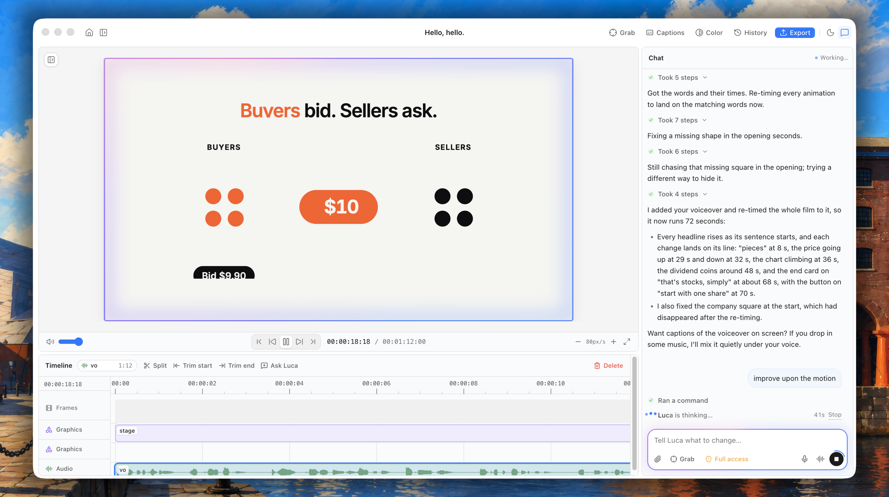

<p align="center">
  
</p>

<p align="center">
  <a href="https://github.com/fozagtx/Luca/releases"></a>
  
  <a href="https://claude.com/claude-code"></a>
  
</p>

#  Luca

Luca edits your videos for you. Drop in what you filmed (a phone clip, a long recording, a screen recording or a voiceover, portrait or landscape), say what kind of video it is, and Luca cuts the ums and pauses, adds captions, zooms, a hook and B-roll. Then keep talking to change anything: “make the captions yellow”, “zoom in when I say the price”, “show our logo at the end”.

Built for people who make content and don’t want to spend the evening editing it:

- **Creators** who film themselves: TikToks, Reels, Shorts and YouTube videos.
- **Faceless channels** and YouTube automation: explainers made from a voiceover or a screen recording.
- **Founders**: updates, stories and pitches, plus short product and launch videos.

## Why Luca

- **Drop it in, get an edit.** Pick what kind of video it is and Luca does the first edit on its own: no timeline skills needed.
- **Talk instead of keyframing.** Describe the change in plain words, or click anything in the preview and say what should change right there. Luca does the editing and asks before anything unusual.
- **Watch it change live.** The preview plays exactly what will export and updates within a second of every edit, without losing your place.
- **Nothing is ever lost.** Every change, Luca’s or yours, is saved as a version you can restore or undo with ⌘Z. Your original footage is never modified.
- **Your Mac, your subscription.** Luca runs on your own Claude subscription through Claude Code and never sees your credentials. Projects are plain folders on your disk.
- **A real editor underneath.** Timeline with trim, split and snapping, Caption Studio, clean edits that cut ums and retakes, color grades, B-roll, voice control and MP4 export.

## Installation

Luca runs on Claude Code, so set that up first:

```bash
brew install node ffmpeg git
npm install -g @anthropic-ai/claude-code
claude          # then type /login and sign in with your Claude subscription
```

Then download the latest `luca-<version>-arm64.dmg` from [Releases](https://github.com/fozagtx/Luca/releases) (Apple silicon, macOS 13+) and drag Luca to Applications. The build isn’t signed yet: the first time, right-click `Luca.app` → **Open**, or allow it under System Settings → Privacy & Security.

That’s the only download: Luca keeps itself up to date. It looks for a newer version when it starts, every 15 minutes and when you come back to it, downloads it in the background and says **Luca x.y.z is ready** with a Restart button (or it goes in when you quit). **Luca → Check for Updates…** checks right away. While the repository is private, GitHub shows its releases only with a token: make a [fine-grained token](https://github.com/settings/personal-access-tokens/new) for this repository with read-only Contents and paste it in Check for Updates….

Optional keys, all entered inside the app and kept in the macOS Keychain:

- [AssemblyAI](https://www.assemblyai.com/) so Luca can hear what’s said: cutting ums and pauses, captions, B-roll that matches your words, and voice input. Strongly recommended; without it Luca can still zoom, title and grade.
- [Pexels](https://www.pexels.com/api/) (free) for B-roll: photos and short clips of what you talk about.
- [Gemini](https://aistudio.google.com/apikey) for making and editing video clips (Gemini in the toolbar). Generation is billed to the key’s Google Cloud project, so a key made in a project with Google Cloud credits uses them.
- [ai33](https://ai33.pro) for voiceovers, music and sound effects: paste a script and Luca records it, or ask for quiet music under your voice or a whoosh on a title. One key, entered the first time Luca needs it (or any time in Connections: **Luca → Connections…**, ⌘,) and stored encrypted on your Mac. ai33 is a separate paid service: you buy credits from ai33, every job uses some, and Luca asks before spending a lot.

## Edit your first video

1. **Drop your video on Luca.** One clip or several (they play back to back), short or long, portrait or landscape. Faceless? Drop your voiceover. A logo or screenshots can come along too.
2. **Say what kind of video it is:** Talking video, Faceless explainer, Founder video or Product video. Luca switches on the edits that suit it (cut ums & pauses, hook title, punch-in zooms, B-roll, name title, ending card, captions); change any of them, add a note (“I’m Sam, founder of Acme”) and pick the shape (turn a landscape video into a vertical short).
3. **Watch Luca edit it, then keep talking.** “Make the captions bigger.” “Cut the part where I cough.” Press **G** to grab anything in the preview and comment on it.
4. **Export.** Press ⌘E for an MP4, rendered in the background.

## Built with

Luca is free and MIT-licensed. It stands on these tools, and couldn’t exist without them.

<!-- built-with:start -->
<table align="center">
  <tbody>
    <tr>
      <td colspan="20" width="850" align="center"><a href="https://claude.com/claude-code"> <b>Claude Code</b></a><br /><sub>The brain: Luca plans and makes every edit through it</sub></td>
    </tr>
    <tr>
      <td colspan="4" width="170" align="center"><a href="https://ai.google.dev/gemini-api"> <b>Gemini</b></a><br /><sub>New clips, restyles and continuations</sub></td>
      <td colspan="4" width="170" align="center"><a href="https://ai33.pro"><b>ai33</b></a><br /><sub>Voiceovers, music and sound effects</sub></td>
      <td colspan="4" width="170" align="center"><a href="https://github.com/heygen-com/hyperframes"><picture><source media="(prefers-color-scheme: dark)" srcset="docs/logos/hyperframes-dark.svg" /></picture></a><br /><sub>Preview and render</sub></td>
      <td colspan="4" width="170" align="center"><a href="https://www.remotion.dev/"> <b>Remotion</b></a><br /><sub>Animated components</sub></td>
      <td colspan="4" width="170" align="center"><a href="https://remocn.dev/"> <b>remocn</b></a><br /><sub>Titles, transitions and effects</sub></td>
    </tr>
    <tr>
      <td colspan="4" width="170" align="center"><a href="https://www.assemblyai.com/"><picture><source media="(prefers-color-scheme: dark)" srcset="docs/logos/assemblyai-dark.png" /></picture></a><br /><sub>Transcripts and voice</sub></td>
      <td colspan="4" width="170" align="center"><a href="https://www.pexels.com/"> <b>Pexels</b></a><br /><sub>B-roll</sub></td>
      <td colspan="4" width="170" align="center"><a href="https://www.electronjs.org/"> <b>Electron</b></a><br /><sub>The Mac app</sub></td>
      <td colspan="4" width="170" align="center"><a href="https://ffmpeg.org/"> <b>FFmpeg</b></a><br /><sub>Footage and audio</sub></td>
      <td colspan="4" width="170" align="center"><a href="https://ui.shadcn.com/"><picture><source media="(prefers-color-scheme: dark)" srcset="docs/logos/shadcnui-dark.svg" /></picture> <b>shadcn/ui</b></a><br /><sub>Interface</sub></td>
    </tr>
  </tbody>
</table>
<!-- built-with:end -->

<p align="center"><b>Coming soon:</b> <a href="https://higgsfield.ai/"> Higgsfield</a>, to find and generate media right from the chat.</p>

Building a tool Luca should talk to? [Open an issue](https://github.com/fozagtx/Luca/issues) and it could live here.

## Everything Luca can do

<details>
<summary>Every feature, in one table</summary>

|     |                          |                                                                                                                                                                                                                                                                                                                                                                                                                                                                                                                                                                                                                                                                                                                                                      |
| --- | ------------------------ | ---------------------------------------------------------------------------------------------------------------------------------------------------------------------------------------------------------------------------------------------------------------------------------------------------------------------------------------------------------------------------------------------------------------------------------------------------------------------------------------------------------------------------------------------------------------------------------------------------------------------------------------------------------------------------------------------------------------------------------------------------- |
| F1  | **Projects**             | Start from your footage: one or more videos (played back to back) or a voiceover, short or long, portrait or landscape, with a logo or screenshots as extras. Drop them on the start card or the chat, press ⌘N, or open them from Finder. The project takes the shape of your footage, or pick another (a landscape video becomes a vertical short, cropped to fit), and iPhone HEVC and HDR clips just work. While Luca edits, light circles the preview and a cover says what Luca is doing and about how long is left (Watch Luca edit lifts the cover). Reopen, forget or trash recent projects; Home (⇧⌘W) goes back to the start screen. Your footage is never modified.                                                                      |
| F1b | **Video types**          | Say what kind of video it is and Luca does the first edit right away: **Talking video** (creators on camera: cut, hook title, punch-in zooms, bold captions), **Faceless explainer** (a voiceover or screen recording: cut, hook title, B-roll of what’s said, captions), **Founder video** (cut, gentle zooms, name title, calm captions) or **Product video** (cut, zooms into the screen, ending card, captions). Switch any edit on or off and add a note (“I’m Sam, founder of Acme”). The plan stays with the project, so later edits keep to it.                                                                                                                                                                                              |
| F2  | **Live preview**         | Plays your video exactly as it will export; updates within a second of every change and keeps your place.                                                                                                                                                                                                                                                                                                                                                                                                                                                                                                                                                                                                                                            |
| F3  | **Timeline**             | Tracks, clips, captions and audio waveform; playhead, zoom, snapping; drag to move, trim, split; a selection bar and right-click menu to split, trim to the playhead or delete; track mute and lock; undo toasts.                                                                                                                                                                                                                                                                                                                                                                                                                                                                                                                                    |
| F4  | **Chat**                 | Luca works on your own Claude subscription, shows what it is doing in plain words (“Luca is adding a lower third…”); the message box and the preview's edges glow while it works, streams replies and asks before unusual steps. Drop, paste or attach videos, audio and images in the chat: Luca adds them to the video or uses them as a reference (“make the captions like this”). ⌘↩ allows, ⌘. stops.                                                                                                                                                                                                                                                                                                                                           |
| F4b | **Queue**                | Keep going while Luca works: new requests line up in a queue above the message box instead of piling into the conversation. See what Luca is doing now and what's next; edit, remove or hold anything still waiting.                                                                                                                                                                                                                                                                                                                                                                                                                                                                                                                                 |
| F5  | **Comment on the video** | Click Grab (G), click anything in the preview, and write what should change in the box that opens right there; it goes to Luca with that part of the video attached. ⌥-click comments on the whole frame.                                                                                                                                                                                                                                                                                                                                                                                                                                                                                                                                            |
| F5b | **Move & resize**        | Click anything in the preview (or select its clip) to get handles: drag to move, drag a corner to resize, or click Comment to tell Luca what to change. Animations keep playing on top.                                                                                                                                                                                                                                                                                                                                                                                                                                                                                                                                                              |
| F6  | **Components**           | Every ready-made title, lower third, callout, chart and transition, found and picked by Luca from what you describe; there is nothing to browse. Extras set themselves up in the background the first time Luca needs one.                                                                                                                                                                                                                                                                                                                                                                                                                                                                                                                           |
| F6b | **B-roll**               | Photos and short clips from Pexels of the things you talk about, shown as a cutaway or a card while you keep talking. Luca finds them itself on explainers, or search the B-roll tab (⌘2), switch between Photos and Videos and click one to tell Luca where it goes. Never used as a background: your footage fills the frame.                                                                                                                                                                                                                                                                                                                                                                                                                      |
| F6c | **Video with Gemini**    | Connect a Gemini API key (Gemini in the toolbar) and ask Luca for footage nobody filmed: “an 8-second clip of a woman with blown-out hair in a studio, wind in her hair”, “a vertical 1080×1920 clip of…”. Luca makes it with Gemini Omni (sound included), looks at it and puts it in your video. It changes clips you already have too: restyle, relight, add or remove something (“make it anime, keep everything else the same”), start on or end on a picture, bring a photo to life, or continue a clip (10 s at a time, up to 40 s). A size you ask for is cropped and scaled from Gemini’s 16:9 or 9:16 frame (360p to 4K); otherwise clips match your video. Each clip takes a few minutes and is billed to the key’s Google Cloud project. |
| F6d | **Start from a script**  | No footage? Choose **Start from a script** on the start card (or in ⌘K), paste your script, pick a language and a voice, and Luca records it, builds the video around it and does the first edit: hook title, B-roll of what’s said, captions and, if you switch it on, music. The words come from your script, so they’re exact: nothing to transcribe (no AssemblyAI key needed) and nothing to clean. Luca records the first part first to check the price and asks before the rest if it would use a lot of credits; Cancel keeps what’s recorded, so trying again only pays for the rest. In any project you can also ask for a voiceover, a line at a moment, or a chat between two or three voices.                                           |
| F6e | **Voice library**        | Hear a voice before you use it: Studio voices sound the most natural, Standard voices are simpler, and voices you made on ai33 show up as Yours. Search by language and gender on the start card, or ask Luca for “a younger voice” and pick from a few to listen to. **Say it right** teaches Luca how to say brand names and short forms; only the voice changes, never the captions.                                                                                                                                                                                                                                                                                                                                                              |
| F6f | **Music**                | Ask for music (“add calm music”) or switch on the Music step on the start card. Luca makes an instrumental, keeps both takes, and puts the first on its own Music row under the whole video: it fades in and out, sits well under your voice and never makes the video longer. Trim it by hand and it stays trimmed; cut the video shorter and it shortens to match. Try the other take with no new credits; ⌘Z removes the music, and asking for it again is free.                                                                                                                                                                                                                                                                                  |
| F6g | **Sound effects**        | A whoosh as the title lands, a click on a number: name the moment (“a whoosh where the title appears”) and Luca makes short effects and drops each one there, sharing a few Sound effects rows so the timeline stays tidy. The price is exact (50 credits a second) and a big batch is confirmed first.                                                                                                                                                                                                                                                                                                                                                                                                                                              |
| F7  | **Clean edit**           | A word-by-word transcript, then cuts for ums, pauses and retakes, applied to make a clean master with captions that follow. Luca does it as part of the first edit, or run it from the Transcript tab; every step shows real progress.                                                                                                                                                                                                                                                                                                                                                                                                                                                                                                               |
| F7b | **Captions**             | Caption Studio: words cleaned of ums, stutters and false starts, grouped into lines; ten animated styles previewed live, each with its own colours, outline, box and weight; built-in fonts, the ones included with Luca (Helvetica, Montserrat Thin, Mermaid and more), your own, or any Google font from a pasted link or its name (saved with the project, so it exports offline); one click puts them on the timeline, or ask Luca to match a look. Captions stay in sync as you split, trim, move or clean up the video.                                                                                                                                                                                                                        |
| F7c | **Color**                | Grade the footage with a look that comes with Luca (Color in the toolbar), each previewed on your own frame with an intensity slider, or ask Luca for “something warmer”.                                                                                                                                                                                                                                                                                                                                                                                                                                                                                                                                                                            |
| F8  | **Looks**                | Save a project's style as a named Look and apply it to a new project in one click.                                                                                                                                                                                                                                                                                                                                                                                                                                                                                                                                                                                                                                                                   |
| F9  | **Versions**             | Every change Luca or you make is saved as a version: browse history, restore, ⌘Z.                                                                                                                                                                                                                                                                                                                                                                                                                                                                                                                                                                                                                                                                    |
| F10 | **Export**               | Render MP4 (Draft or Final) in the background with progress and cancel, then Reveal in Finder. Bigger Macs render with more parallel workers.                                                                                                                                                                                                                                                                                                                                                                                                                                                                                                                                                                                                        |
| F13 | **Voice**                | Talk to Luca hands-free or dictate, with live speech-to-text; nothing reaches Luca until you approve it. Voice mode: press ↩ or ⌘↩, click Send, or just say “send it” (“scratch that” drops it), and replies are read aloud while an orb shows Luca listening, working and talking back. Dictation: press ↩ when you're done, then approve the card with ⌘↩ or Send.                                                                                                                                                                                                                                                                                                                                                                                 |
| F14 | **Keyboard**             | `/` to type to Luca, `?` for every shortcut, ⌘K for commands. A notification tells you when Luca finishes or needs your OK while you're in another app.                                                                                                                                                                                                                                                                                                                                                                                                                                                                                                                                                                                              |
| F15 | **Cost cards & credits** | ai33 is a separate paid service with its own credits. Luca checks your balance before anything is made and asks first (a cost card: Go ahead or Not now, ⌘↩ allows) when a job is big, when ai33 can’t say the price beforehand, or when it’s a batch; it never makes more than a few things in one turn, and each finished step says what it used (“Made music · 3,600 credits”). Every job shows its percent and time with a Stop button, slow ones finish in the background and Luca tells you when they’re ready, and nothing is paid for twice: asking again for the same thing is free, and saved files come back after an undo.                                                                                                               |
| F16 | **Connections (⌘,)**     | One place for your ai33 key: connect, change or disconnect it, see your credits and whether the voice services are busy. Luca also asks for the key inside the chat the moment a request needs it, then carries on when you connect. The key stays on this Mac, encrypted, and is only ever sent to ai33.                                                                                                                                                                                                                                                                                                                                                                                                                                            |

</details>

## Run from source

Prerequisites: everything under [Installation](#installation) (with Node 22+), plus the HyperFrames browser (`npx hyperframes browser ensure`). For development you can also set `PEXELS_API_KEY` and `GEMINI_API_KEY` in the environment, or `MAIN_VITE_PEXELS_API_KEY` in a git-ignored `.env` to build a key into the app (anyone with the build can read it). ai33 has no build-time key, on purpose: a key built into an app spends its owner’s credits for everyone. Set `AI33_API_KEY` to use a key when none is saved in Luca, and `AI33_BASE_URL` to point ai33 at another server (https, or plain http on this Mac); the base URL is honoured only when the app is not packaged.

```bash
npm install
npm run dev        # launch the app
npm run typecheck && npm run lint
npm run dist       # unsigned .dmg + .zip in dist/

npm run ai33:fake  # a fake ai33 on http://127.0.0.1:8787: no key, no credits, every failure on demand
npm run ai33:smoke # the ai33 checks against that fake (about 15 s); exits 1 if any check fails
AI33_BASE_URL=http://127.0.0.1:8787 AI33_API_KEY=fake npm run dev   # the app against the fake
```

**Releases.** Every push to `main` (except docs-only changes) builds the app on GitHub Actions and publishes it as the latest release, `v0.1.<run number>`: the dmg, the zip and `latest-mac.json` (the zip’s version, size and SHA-512), which is what running copies update from. A `v*` tag releases that exact version instead. Bump `major.minor` in `package.json` to start a new series; the patch number is the build’s. Updates only reach an installed app: `npm run dev` never updates itself.

**What’s verified.** The ai33 integration is built from ai33’s published contract and tested against a fake ai33 server and unit-level checks: `npm run ai33:smoke` runs the parts that don’t need Electron (the client and job runner, ledger, spend policy, script chunker and timing, timeline and export checks, the edit plan) against the fake, through the same configuration the app uses. It has **not** been run against the real ai33 API, and not on a Mac with real `ffmpeg` and a Keychain; the parts that import Electron or call `ffmpeg` (saving and measuring the audio, joining a script’s parts, the tool wrappers, the screens) are only checked in the app. Before it ships, a real key needs to confirm what the contract leaves open. The code is written to survive each guess, but hasn’t seen the real answer:

- the shape of a row in the recent-tasks list (`GET /v1/tasks`), which is how a job whose answer got lost is found again;
- the shape of the transcript files a voiceover can return (word times and subtitles), which time the captions of a script start;
- the shape of the voice list, of the pronunciation dictionary list, and which values the language filter takes;
- what speech and music cost: Luca guesses 3,600 credits for a piece of music until it has seen a real price, and learns the speech price from the first job.

**Where script text is kept on your Mac.** A script you record is kept in the project (`.luca/SCRIPT.md` and `transcript.json`), in ai33’s word timing under `userData/ai33/cache/tts` for 90 days (so recording it again costs nothing), and as up to 80 characters of each request in the job ledger `userData/ai33/jobs.json`, and `AI33_API_KEY` is read only in development builds, so a packaged Luca uses only the key saved in Connections.

<details>
<summary><b>How it works</b> (for developers)</summary>

The app itself never names the tools below; they are here for people building Luca from source.

- **HyperFrames HTML is the composition.** `index.html` plus `compositions/*.html` are the single source of truth for the timeline; Luca reads them through the `hyperframes` CLI and never invents a second format. Sources stay immutable in `media/`.
- **Electron main owns side effects**: a loopback HTTP server (Range requests, per-session cookie token — never `file://`) serves the project to the preview; a file watcher hot-reloads and re-seeks; `ffmpeg` and the HyperFrames CLI run as subprocesses.
- **Claude Code via the Agent SDK.** The stock `claude` binary runs in the project directory with a Luca MCP server (`transcribe` and `clean_edit` for the words and the cuts, `catalog_search` over HyperFrames + Remocn, the remocn tools, `captions_apply` for Caption Studio's captions, `font_add` for Google Fonts, `lut_apply` for color, and the B-roll, Gemini and ai33 tools below: `speech_generate` and `voice_search` for voiceovers and voices, `music_generate`, `sfx_generate`, `audio_place` to put a saved sound on the timeline safely, and `ai33_status` for credits and finished jobs) and permission callbacks that surface as approval cards in chat.
- **Catalog data.** The HyperFrames catalog comes from `hyperframes catalog --json` and the Remocn index from remocn.dev, cached daily; copies bundled in `src/main/catalog/` keep both available offline. Search and categories live in `src/shared/catalog.ts`.
- **The first edit.** The video types and edit steps live in `src/shared/edits.ts`, with what Luca is told for each. The start card's picks go to `startProject`, which saves the plan as `.luca/EDIT.md` and adds it to the first request; later turns point Luca back to that file (an applied Look still wins). Luca works through it in one turn: `transcribe` (AssemblyAI, progress in the Transcript tab) gives it the words with times, `clean_edit` cuts the fillers and long pauses it finds plus the retakes Luca names, then titles, zooms, B-roll and `captions_apply` land on the cut timeline.
- **B-roll** comes from the Pexels API, called only from main (`src/main/pexels.ts`) so the key never reaches the renderer. Luca's MCP server adds `broll_search` (the best photos and short clips, with small previews Luca looks at before choosing) and `broll_add`, which downloads the pick into `media/broll/` sized for the composition (photos cropped to the frame, videos as the smallest MP4 that fills it) and credits it in `media/broll/CREDITS.txt`. The agent is told to use it only for things that are said, as cutaways over the footage, never as a background.
- **Video with Gemini** uses Gemini Omni Flash (`gemini-omni-1.1-flash`) through the Interactions API with Google’s `@google/genai` SDK, called only from main (`src/main/gemini.ts`). Luca’s MCP server adds `video_generate`: pictures and clips from the project are uploaded with the Files API (clips trimmed to the 10 s Omni reads, at most 720p, without sound when Omni should make new sound), the prompt gets Omni’s `[# Sources …] [# References …]` tags, and the interaction runs in the background while Luca polls it (stopping a turn cancels it). The video is downloaded into `media/generated/`, cropped and scaled to the size asked for (else the project’s frame), and frames from it go back to Luca to check. Interaction ids are kept in `.luca/cache/gemini/made.json`, so editing or continuing a generated clip builds on Gemini’s own copy (`previous_interaction_id`).
- **Voices, music and sound with ai33** are called only from main, with the key from the Keychain (or `AI33_API_KEY` in development), so the key never reaches the renderer and is only ever sent to ai33’s own host. One client and job runner (`src/main/ai33-client.ts`) serves every kind of job: it submits once, polls `GET /v1/task/:id` (every 1.5 s, then 3 s, then 5 s; a few dropped polls never cancel anything; only a 429 is retried, never a request that may already have made a task) and downloads the files straight away. Every request is hashed and written to an app-level ledger (`userData/ai33/jobs.json`, `src/main/ai33-jobs.ts`) before it leaves, so an identical call joins or reuses the job, and a submit that got no answer is looked up in the account’s recent tasks and adopted only when exactly one matches. Spend policy is code, not a prompt (`src/main/ai33-spend.ts`): the balance is read first, big, unpriced or batch jobs wait for a cost card inside the tool call, each turn has caps, and the estimate is reserved and then settled with what the job really used. Placement is deterministic: each file is checked with `ffprobe` and saved in `media/generated/{speech,music,sfx}/` with a line in `CREDITS.txt`, and `src/main/place-html.ts` writes the `<audio>` tags (the model never writes one); clips carry `data-luca-role` and `data-luca-title`, which name the timeline rows, music is only ever shortened to fit, never lengthened, and the export check blocks only a local sound that can’t be read. A script start (`src/main/ai33-start.ts`) records the script in parts (the first one small, to check the price), joins them and keeps the script’s own words, timed, in `transcript.json`, so nothing is transcribed; `.luca/script.json` marks the project as exact-words.
- **Included fonts** live in `resources/fonts/` and are listed in `BUNDLED_FONTS` (generated by `npm run fonts` into `src/shared/fonts.generated.ts`); to add one, drop its .ttf/.otf there, give the family a note in `resources/fonts/fonts.json` and run `npm run fonts`. They show in Caption Studio, previews load them from the Luca server (`/fonts/`), and a project that uses one gets a copy in `fonts/`, declared in `index.html` like any font added from a file, so exports never need the app.
- **Git is the version store.** Each agent turn or manual edit becomes a commit; History restores any checkpoint.
- **Voice** is AssemblyAI streaming speech-to-text with the Universal-3.5 Pro model (`universal-3-5-pro`) over WebSocket. The renderer captures the mic in an AudioWorklet (16 kHz PCM, 50 ms chunks) and streams it over IPC to main, which holds the socket, so the key never reaches the renderer. Dictation and voice mode both put what was said in the request queue (`src/renderer/stores/queue.ts`) for approval; approved requests go to Luca one at a time when it is free, and in voice mode the reply is read aloud sentence by sentence with the system voice (`src/renderer/lib/speech.ts` is the seam to bring your own TTS). The voice orb is shadercn's ORB-07 on WebGPU (`src/renderer/components/orbs/`, rendered with vgpu and TypeGPU); its shader is by XorDev, for non-commercial use with attribution, and the level meter stands in where WebGPU is unavailable.
- **Updates** (`src/main/updater.ts`) come from GitHub Releases through the REST API (with the saved token for a private repository; the file downloads go to GitHub’s storage without it). The build isn’t signed, and Electron’s Squirrel updater installs only signed apps, so Luca checks the zip against `latest-mac.json`, unpacks it with `ditto` into `~/Library/Application Support/Luca/updates/` and, once Luca has quit, a small script swaps the app bundle and opens it again (putting the old one back if anything fails; `updates/install.log` says what happened). An app running from the disk image or Downloads is offered a move to Applications first.
- **Export** runs `@hyperframes/producer` in an Electron `utilityProcess` (parallel workers sized to the Mac, VideoToolbox) and writes `renders/<name>-<date>.mp4`.
- **UI**: React 19, TypeScript, Tailwind v4, shadcn Base UI, three resizable panes (Transcript/B-roll/Looks · Preview/Timeline · Chat); the sidebar starts hidden (⇧⌘S) and stays hidden on Home, where the start card takes its place. Chat patterns (shimmering status text, steps, prompt input, suggestions, scroll button) are adapted from [prompt-kit](https://www.prompt-kit.com/) (MIT).

</details>

## License

MIT © fozagtx. HyperFrames, Remotion and remocn are subject to their own licenses, and so are the fonts in `resources/fonts/`.

Music, voices and sound effects made with ai33 carry ai33’s terms of use, not Luca’s license. Luca records each one in `media/generated/CREDITS.txt` inside the project, and doesn’t claim any of it is royalty free or safe to sell: if you sell or license your videos, read ai33’s terms first.
